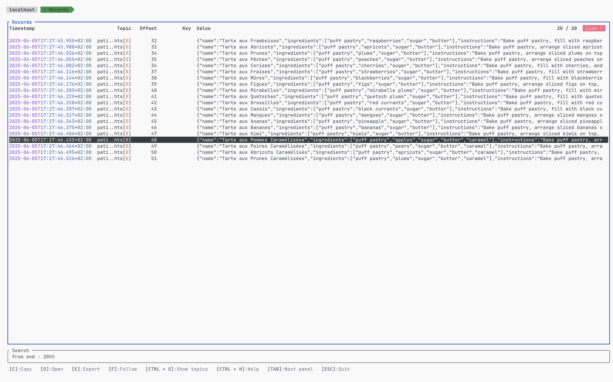
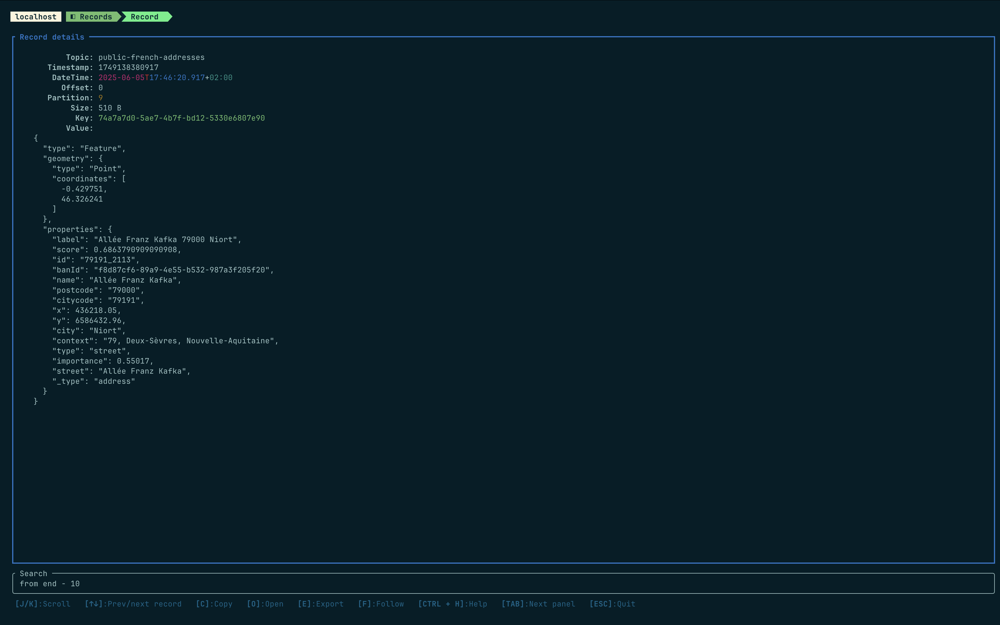

# What is Yōzefu?


Yōzefu is designed to be a fast and efficient tool to explore Kafka clusters from the terminal. It aims to provide a user-friendly interface while leveraging the power of the terminal for quick navigation and operations. More details on this [blog post](https://mcdostone.github.io/articles/why-yozefu/).


Yōzefu is a reference to the main character of **The Trial**, the novel of Franz Kafka.


## A TUI and a CLI

Yōzefu can be used as an interactive terminal user interface (TUI) or as a command-line interface in headless mode.

**TUI mode**
```shell
yozf --cluster preproduction \
-t my.topic.of.books \
"from begin where key == '978-2070315932' limit 1" \
--format transpose
```

**Headless mode**
```shell
yozf --headless \
-c preproduction \
-t my.topic.of.books \
"from begin where key == '978-2070315932' limit 1" \
--format simple
```

## Limitations

 - The tool is designed only to consume kafka records. There is no feature to produce records or manage a cluster.
 - Serialization formats such as json, xml or plain text are supported. Avro support is experimental for now. Protobuf is not supported.
 - ōzefu gives you the feeling that every kafka records stays in memory but in reality, it uses a ring buffer to store only the last 500 kafka records.
 - There is probably room for improvement regarding the throughput (lot of clone() and deserialization).
 - Yōzefu has been tested on macOS Silicon but not on Windows or Linux. Feedback or contributions are welcome.


## Screenshots




